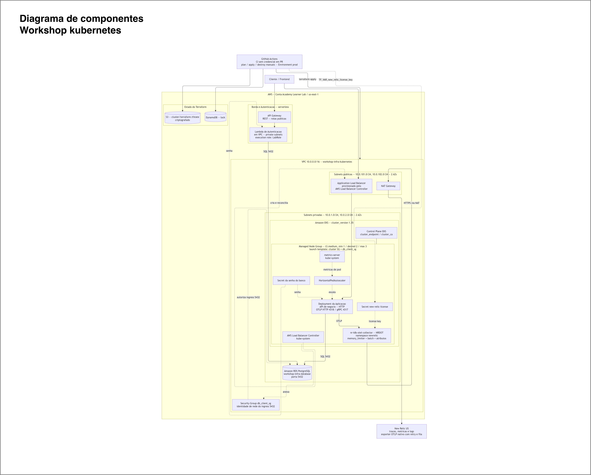

# workshop-infra-kubernetes

> Infraestrutura **Kubernetes** da **Fase 3** do Tech Challenge (SOAT): VPC, cluster
> **EKS**, node group, `metrics-server` e **AWS Load Balancer Controller**.
> Este repositorio **autora o contrato de outputs** consumido pelos repos de banco e
> serverless. Nao contem nenhum recurso de banco de dados.

---

## Proposito

Provisiona a fundacao de rede e computacao sobre a qual toda a Fase 3 roda. E o
**primeiro repositorio a ser aplicado** e o **ultimo a ser destruido**, porque os demais
consomem seus outputs:

| Entrega | Detalhe |
|---|---|
| **Rede** | VPC, subnets publicas e privadas, NAT gateway |
| **Computacao** | Cluster EKS + managed node group com launch template |
| **Add-ons** | `metrics-server` (habilita o HPA) e AWS Load Balancer Controller |
| **Observabilidade** | Collector NRDOT (`nr-k8s-otel-collector`) no namespace `newrelic` |
| **Integracao** | `db_client_sg_id` — identidade de rede que autoriza o acesso EKS → RDS |
| **Contrato** | `outputs.tf` e a interface publica consumida por banco e serverless |

---

## Tecnologias utilizadas

| Camada | Tecnologia |
|---|---|
| IaC | **Terraform >= 1.6**, provider AWS `~> 5.60` |
| State | Backend **S3** (`cluster/terraform.tfstate`) com lock em **DynamoDB**, criptografado |
| Computacao | **Amazon EKS** (`aws_eks_cluster` / `aws_eks_node_group` diretos, sem modulo) |
| Kubernetes | Versao centralizada em `var.cluster_version` — baseline **1.35** |
| Add-ons | `metrics-server`, AWS Load Balancer Controller, chart `nr-k8s-otel-collector` (New Relic) |
| Observabilidade | **NRDOT / OpenTelemetry** — OTLP HTTP (4318) e gRPC |
| CI/CD | GitHub Actions — CI sem credenciais em PR; plan/apply/destroy manuais protegidos por Environment `prod` |
| Ambiente | **AWS Academy Learner Lab** (`LabRole`, credenciais temporarias ~4h) |

---

## Ordem de execucao na Fase 3

```text
APPLY:    workshop-infra-kubernetes → workshop-infra-database → workshop-auth-serverless
DESTROY:  workshop-auth-serverless → workshop-infra-database → workshop-infra-kubernetes
```

O banco consome a VPC e as subnets deste state; destrui-lo depois do cluster deixa
recursos orfaos.

## Fronteira

| | |
|---|---|
| **Contem** | VPC, subnets, NAT, EKS, node group, metrics-server, LB Controller, SG de cliente do banco |
| **Nao contem** | Qualquer `aws_db_*` (vive em [workshop-infra-database](https://github.com/postech-software-architecture/workshop-infra-database)), manifestos k8s, Lambda/API Gateway |

A CI de PR verifica formato, validade e politicas sem credenciais AWS. O plan real e
executado somente pelo workflow manual de apply, depois do merge em `main`; nele a
fronteira e verificada sobre o JSON do plan e falha se algum `aws_db_*` aparecer.

## Contrato de outputs

`outputs.tf` **e** o contrato entre os repositorios. Consumidores:

| Output | database | serverless |
|---|---|---|
| `vpc_id` | sim | sim |
| `vpc_cidr` | sim | — |
| `private_subnet_ids` | sim (subnet group) | sim (Lambda em VPC) |
| `db_client_sg_id` | sim (ingress 5432) | sim |
| `cluster_endpoint` / `cluster_ca` | — | — (pipelines de deploy) |
| `lab_role_arn` | — | sim (execution role) |

**Remover ou renomear um output quebra o `plan` a jusante.** Adicionar e seguro;
renomear exige PR coordenado nos dois repos, na mesma janela.

Nenhum segredo trafega por output. A senha do banco vive em Environment secret,
consumida igualmente pelo k8s Secret e pela Lambda.

## Como executar e fazer deploy

```bash
terraform fmt -check -recursive
terraform init -backend=false && terraform validate   # sem credencial

# com credencial do Academy (AWS Details -> inclui aws_session_token, expira ~4h)
export AWS_ACCESS_KEY_ID=... AWS_SECRET_ACCESS_KEY=... AWS_SESSION_TOKEN=...
terraform init && terraform plan
terraform apply    # medido no Academy: ~16 min
terraform destroy  # ~10 min — SEMPRE ao final
```

Depois do apply:

```bash
aws eks update-kubeconfig --name $(terraform output -raw cluster_name) --region us-east-1
kubectl get nodes                                    # Ready
kubectl -n kube-system get deploy metrics-server     # 1/1
kubectl -n kube-system get deploy aws-load-balancer-controller
```

### W5 — NRDOT no EKS

O apply instala o chart oficial `nr-k8s-otel-collector` da New Relic no namespace
`newrelic`, usando a imagem NRDOT com versoes fixadas em `variables.tf`. O collector
recebe OTLP HTTP/gRPC da aplicacao, aplica `memory_limiter`, `batch` e atributos
`deployment.environment`/`service.name`, e exporta traces, metricas e logs para o
New Relic US com retry e fila de envio.

Antes de executar o workflow `Terraform — Apply EKS`, crie no Environment `prod` o
secret `NEW_RELIC_LICENSE_KEY`. O workflow injeta esse valor somente como
`TF_VAR_new_relic_license_key`; ele nao aparece no Git, nos outputs ou no summary.
O precondition do Terraform interrompe o apply se o secret estiver ausente ou curto.

Depois do apply, valide:

```bash
kubectl -n newrelic get deploy,daemonset,pods,svc
kubectl -n newrelic logs deploy/nr-k8s-otel-collector --since=10m | grep -E 'exporter|error|retry'
kubectl -n newrelic get secret new-relic-license
```

O endpoint interno para a aplicacao e `http://nr-k8s-otel-collector.newrelic.svc.cluster.local:4318`.
Esse nome e um Service alias gerenciado por este Terraform; o chart oficial usa
internamente um Service com sufixo `-gateway`. A exportacao usa o exporter OTLP
New Relic nativo do chart, que ja aplica TLS, retry e fila de envio.
Nao altere o secret manualmente: uma nova chave deve ser aplicada pelo Terraform.
O destroy remove namespace, secret e collectors junto com o cluster.

### Acesso EKS -> RDS

O launch template dos managed nodes anexa simultaneamente:

- o security group primario do cluster, necessario para a comunicacao entre control
  plane, nodes e workloads do EKS;
- o `db_client_sg_id`, usado exclusivamente como identidade no ingress 5432 do RDS.

O repositorio de banco deve autorizar `db_client_sg_id` no security group do RDS. Este
repositorio nao cria nem altera recursos `aws_db_*`.

Com o state vazio apos um destroy, o proximo apply cria o launch template e o node group
ja com os dois SGs; nao existe replacement. Se ainda houver um ambiente criado antes desta
mudanca, o Terraform deve mostrar a **substituicao de `aws_eks_node_group.default`**, pois
nao e possivel adicionar um launch template a um managed node group existente. O control
plane, a VPC e os security groups permanecem. Nesse segundo cenario, planeje uma janela
sem dependencia de workloads; o ambiente Academy pode ficar temporariamente sem nodes
enquanto o novo grupo e criado. Depois, mudancas na versao do launch template usam rolling
update com `max_unavailable = 1`.

Antes de aprovar o plan, confirme:

```text
aws_launch_template.eks_nodes: create
state vazio: aws_eks_node_group.default sera criado com launch_template
ambiente legado: aws_eks_node_group.default tera replacement por adicao de launch_template
aws_eks_cluster.this e aws_security_group.db_client: sem replacement no ambiente legado
zero recursos aws_db_*
```

O workflow `Terraform — Apply EKS` bloqueia qualquer delete ou replacement por padrao.
A unica excecao e a substituicao isolada de `aws_eks_node_group.default`, quando o state
legado ainda possui o node group sem launch template. Para autoriza-la, alem de
`APLICAR-PROD`, preencha o input separado com o texto exato
`SUBSTITUIR-NODE-GROUP-COM-DOWNTIME-E-CUSTO`. Essa opcao implica janela sem nodes,
indisponibilidade dos workloads e possivel custo temporario durante a troca. Com state
vazio, deixe esse segundo input em branco: o plan esperado contem apenas criacoes.

O backend remoto e os workflows manuais de apply/destroy estao documentados em
[docs/backend.md](docs/backend.md). O bucket e a tabela de lock sao preservados
quando o EKS e destruido.

## AWS Academy

- `LabRole` e a **unica** role usavel (IAM bloqueado): cluster e nodes a reusam
- EKS usa recursos `aws_eks_cluster`/`aws_eks_node_group` diretos. O modulo EKS nao
  e compativel porque tenta consultar `iam:GetRole` da role de sessao `voclabs`
- A versao Kubernetes fica centralizada em `var.cluster_version` e aplicada igualmente
  ao control plane e ao node group; o baseline atual e `1.35`
- Credenciais expiram em **~4h** e incluem `aws_session_token`
- Sem IRSA — o LB Controller usa as permissoes herdadas pelo node e roda em
  `hostNetwork` para alcancar o IMDS. Esta e uma excecao do Academy; em uma conta
  convencional, usar IRSA ou EKS Pod Identity. O fallback usa uma replica e rollout
  `Recreate` para nao disputar portas do host
- **Sempre `terraform destroy` ao final da sessao**

## Pendencias

- Confirmar no `terraform plan` real se o node group sera criado (state vazio) ou
  substituido (ambiente legado) antes do apply
- Executar o plan real somente na `main`, pelo workflow manual protegido pelo Environment
  `prod`; PRs nunca recebem credenciais AWS

## Diagrama de componentes



Visao de nuvem, APIs, banco e monitoramento. Fonte editavel:
[`docs/diagrama_componentes_kubernetes.drawio`](docs/diagrama_componentes_kubernetes.drawio)
— abra em [app.diagrams.net](https://app.diagrams.net) ou no draw.io desktop.

| Camada | Componentes | Origem |
|---|---|---|
| Borda | API Gateway, Lambda de autenticacao | workshop-auth-serverless |
| Rede | VPC 10.0.0.0/16, subnets publicas e privadas em 2 AZs, NAT gateway | este repo |
| Computacao | Control plane EKS, managed node group com launch template | este repo |
| Add-ons | `metrics-server` + HPA, AWS Load Balancer Controller + ALB | este repo |
| Observabilidade | Collector NRDOT no namespace `newrelic`, export OTLP para o New Relic US | este repo |
| Banco | RDS PostgreSQL na subnet privada, ingress 5432 autorizado via `db_client_sg` | workshop-infra-database |
| Operacao | GitHub Actions, state em S3 com lock em DynamoDB | este repo |

Ao alterar o diagrama, edite o `.drawio` e reexporte o PNG
(**File -> Export as -> PNG**, com *Transparent Background* desmarcado) para que a imagem
do README acompanhe a fonte.

---

## APIs — Swagger / Postman

Este repositorio provisiona infraestrutura e **nao expoe API propria**. As APIs que rodam
sobre este cluster estao especificadas em:

| API | Especificacao |
|---|---|
| Workshop Service (API REST) | [`workshop-service-fase1/openapi.yaml`](https://github.com/postech-software-architecture/workshop-service-fase1/blob/main/openapi.yaml) — Swagger UI em `/swagger-ui.html` |
| Autenticacao por CPF (Lambda) | [`workshop-auth-serverless/docs/openapi-auth.yaml`](https://github.com/postech-software-architecture/workshop-auth-serverless/blob/main/docs/openapi-auth.yaml) |

A borda publica (API Gateway) que expoe estas APIs e provisionada por
[workshop-auth-serverless](https://github.com/postech-software-architecture/workshop-auth-serverless).

Para inspecionar a API do proprio Kubernetes apos o apply:

```bash
aws eks update-kubeconfig --name $(terraform output -raw cluster_name) --region us-east-1
kubectl cluster-info
```

---

## Agentes

Ver [.claude/agents/README.md](.claude/agents/README.md). Dono: `terraform-cluster`.
